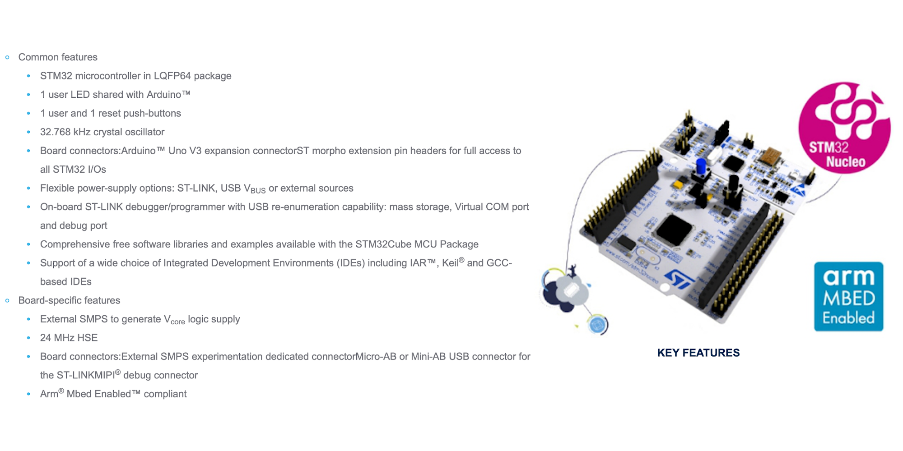
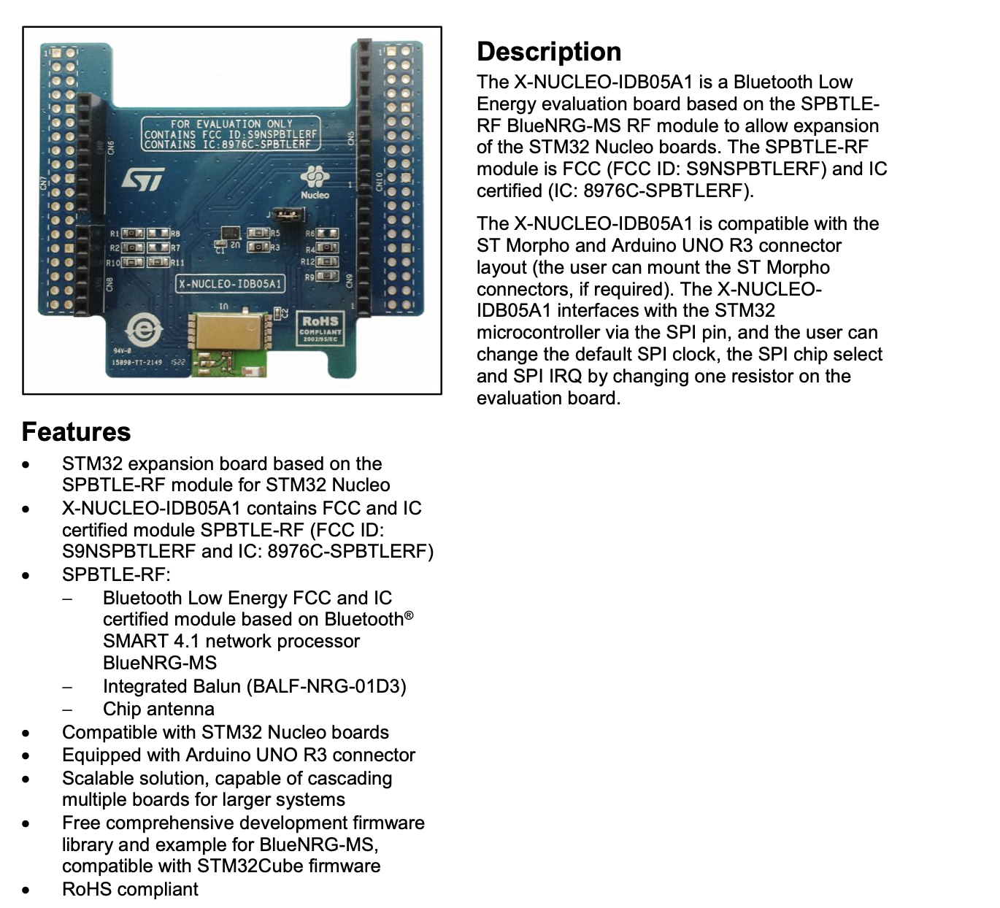
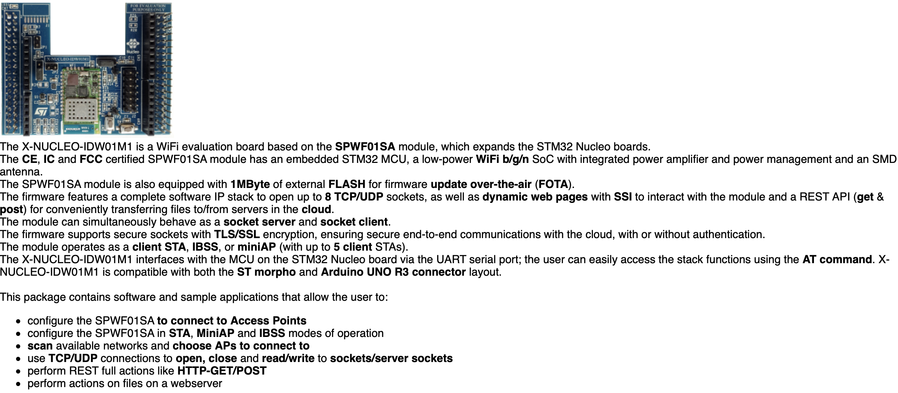

# Ablativo Architecture
The following paragraph describes the architecture of the product, in terms of the software modules that build it. 

Ablativo aims to be an innovative mobile application in the smart museum IoT world.

1. The main flow of the application starts with the interaction between the smartphone and the beacon sensor. 

2. When you enter the area covered by the beacon, the mobile device recognizes the id of the sensor and sends it to the back-end. This communication is managed by Bluetooth Low Energy Technology.

3. Then the back-end searches in the database the pair `<id, statue>` and starts sending messages to the user's chat. The chat acts like a bot. Send predefined questions and answers, the whole Q&A flow can be represented as a finite-state automaton where from a starter state we can always arrive at the final state.

4. The dashboard for data analysis communicates with the back-end and requires data in the database. Then displays the real-time results in an HTML web-page.

5. During the visit we retrieve the values from some sensors to reconstruct the activity/emotions of the user.

6. The data retrieved by the sensors are collected in the database and at the end of the visit are converted into musical notes and then these values are input to a Neural Network that generates a melody

7. Finally, we send to the user the generated melody that represents the activity/emotions of the user during the visit

Now we have a general overview and we can go into the details of the components that make up the main architecture.

**NOTE**: there may be changes in the architecture, we will update this image each time a component is added/removed

---
### Table of contents
* [Mobile application](#app)

* [BackEnd](#be)

* [DataBase](#db)

* [Dashboard for data analysis](#dboard)

* [Google Cloud Platform](#gcp)

* [Sensors](#sensors)
    * [Real Beacon](#beacon)
    * [Simulated Sensors](#simsens)
    * [Smartphone Sensors](#smartsens)

* [User Activity/Emotion recognition](#uaer)

* [Music generation](#rnn)

* [Previous versions](#prev)

---
## Mobile application

It is an open-source application available on our git repository and provided as apk. We are talking about a hybrid app developed on ***React Native***, a cross-platform mobile development framework that allows programmers to create apps for both iOS and Android in one simple language, JavaScript. Indeed React Native runs on React, an open-source library for building UI with JavaScript, this framework through a set of components builds a mobile application with a native look and feel. Due to the pretty simple learning curve and well-balanced performance React Native it’s the perfect compromise for our application.

---
## BackEnd
Core of the application, hosts all the services of the product exposed both to the mobile application and dashboard. 
In this case, the Backend is fully developed on ***Node.js***, an open-source asynchronous event-driven JavaScript runtime designed to build scalable network applications.
Its intrinsic feature of non-blocking I/O, the fantastic community, and overall performance made Node.js the perfect choice for our application. Indeed a Node.js app is run in a single process without creating a new thread for each request and the provided set of asynchronous I/O primitives prevent JavaScript code from blocking.

---
## DataBase
Data storing module, contains all the data of the application. Implemented with MongoDB, one of the most popular document-oriented Database (NoSql) well suited to live with Node.js environment. As said in **MongoDB** official site:
> *Built around JSON-like documents, document databases are both natural and flexible for developers to work with. They promise higher developer productivity and faster evolution with application needs. As a class of non-relational, sometimes called NoSQL database, the document data model has become the most popular alternative to tabular, relational databases.*

---
## Dashboard for data analysis
Management and monitoring module, practically speaking the admin console. In this case, a web application running on every browser developed in Handlebars, a simple templating language that uses a template and an input object to generate HTML or other text formats. Furthermore, we will use WebSockets transport protocol to show the data in real-time. Finally the basic technology for a common web application: BootstrapCSS, JavaScript, JQuery.

---
## Google Cloud Platform
It is a suite of cloud computing services that works on the same infrastructure that Google uses internally for its ends user products, such as Google Search, Gmail, and YouTube.
In particular, in this project, we will use the:
* `Pub/Sub` service to manage the MQTT communication
* `IoT Core` service to register the sensors
* `AI Platform` service to upload the RNN for music generation

---
## Sensors

### Real Beacon
Beacon uses the proximity perception of Bluetooth LE to transmit a unique universal identifier (UUID), which will then be read by a specific app or operating system. Once the signal is read, the app can perform various scheduled actions.
To realize this procedure in our system we have chosen an **STM32 Beacon**

The following are a table with the main parameters we are interested in, more technical details are described in the next sections:

| Beacon STM32 |  |
|:---|:---:|
| BLE | ✅ |
|Bluetooth version | 4.1 |
| CPU | ARM Cortex-M| 
| Cost | 35-38€ |

The beacon is made of three components: 
* `NUCLEO-F401RE` STM32 Nucleo board
* `X-NUCLEO-IDB05A1` BLE expansion board
* `X-NUCLEO-IDW01M1` Wifi expansion board

* #### NUCLEO-F401RE
 The STM32 Nucleo board is a low-cost and easy-to-use development platform used to quickly evaluate and start a development with an STM32 in 32-pin package, 64-pin package and 144-pin package.
 [NUCLEO-F401RE official references on STM32](https://www.st.com/en/evaluation-tools/nucleo-f401re.html)
 

* #### X-NUCLEO-IDB05A1
 Bluetooth Low Energy expansion board based on the SPBTLE-RF BlueNRG-MS module for the STM32 Nucleo board.
 [X-NUCLEO-IDB05A1 official references on STM32](https://www.st.com/en/ecosystems/x-nucleo-idb05a1.html)

 

* #### X-NUCLEO-IDW01M1
 WiFi expansion board based on the SWPF01SA module for STM32 Nucleo.
 [X-NUCLEO-IDW01M1 official references on STM32](http://www.st.com/web/catalog/tools/FM146/CL2167/SC2006/PF262207)

 

### Simulated Sensors
`Temperature`, `Humidity`, and `Heart Rate` sensors will be simulated with a script that randomly and periodically sends the values to the cloud.

### Smartphone Sensors
We will periodically retrieve values from 4 smartphone sensors:
* `Accelerometer` 
* `Gyroscope`
* `Ambient Light Sensor`
* `Microphone`

To retrieve them we use React Native framework sensors API. These values will be necessary to detect the user action therefore for the generation of the final melody.

---
## User Activity/Emotion recognition
In this part we will deal with the technical aspects we have in mind to create a personalized melody for the user.

#### Data Collection
The first thing to do is to extract the values from the sensors. We decided to use:
* ***3 ambient sensors***: `Temperature` and `Humidity` with STM32 Nucleo board and the `Ambient Light Sensor` with the smartphones of the users. These aren't personal values but they affect the emotional condition of the users.
* ***4 personal sensors***: `Accelerometer`, `Gyroscope`, `Microphone`, `Heart Rate Sensor`. These values are different for every user because they depend on the activity they are doing.
* ***Interaction with application***: `Most frequently asked questions`, `Time spent with the statue with which he interacted most`, `Total application usage time`. These are three main measure that helps us to understand how the user interacts with the statues. 

We based our analisys on these papers: 
* [Emotion Detection Using Noninvasive Low Cost Sensors](https://arxiv.org/pdf/1708.06664.pdf)
* [*MoodExplorer: Towards Compound Emotion Detection via Smartphone Sensing*](https://dl.acm.org/doi/pdf/10.1145/3161414?download=true)
* [*Emotion recognition using mobile phones*](https://www.researchgate.net/publication/317123457_Emotion_recognition_using_mobile_phones)

#### Convert data into musical notes
To convert data in music notes we will try to use python Music Algorithms:

* [*Convert Scientific Data into Synthesized Music*](https://makezine.com/projects/synthesized-music-data/)

* [*Numbered musical notation*](https://en.wikipedia.org/wiki/Numbered_musical_notation)

---
## Music generation
In the world of machine learning there are many ways to generate music. These options are the most likely for our purposes:

* [*Magenta*](https://hello-magenta.glitch.me)
* [*Neural Nets for Generating Music*](https://medium.com/artists-and-machine-intelligence/neural-nets-for-generating-music-f46dffac21c0)
* [*How to Generate Music using an LSTM Neural Network in Keras*](https://towardsdatascience.com/how-to-generate-music-using-a-lstm-neural-network-in-keras-68786834d4c5)
* [*Music Generation Using Deep Learning*](https://medium.com/datadriveninvestor/music-generation-using-deep-learning-85010fb982e2)

---
## Previous versions

* [Architecture - delivery 1](https://github.com/Ablativo/ablativo/blob/1st-delivery/Architecture.md)
