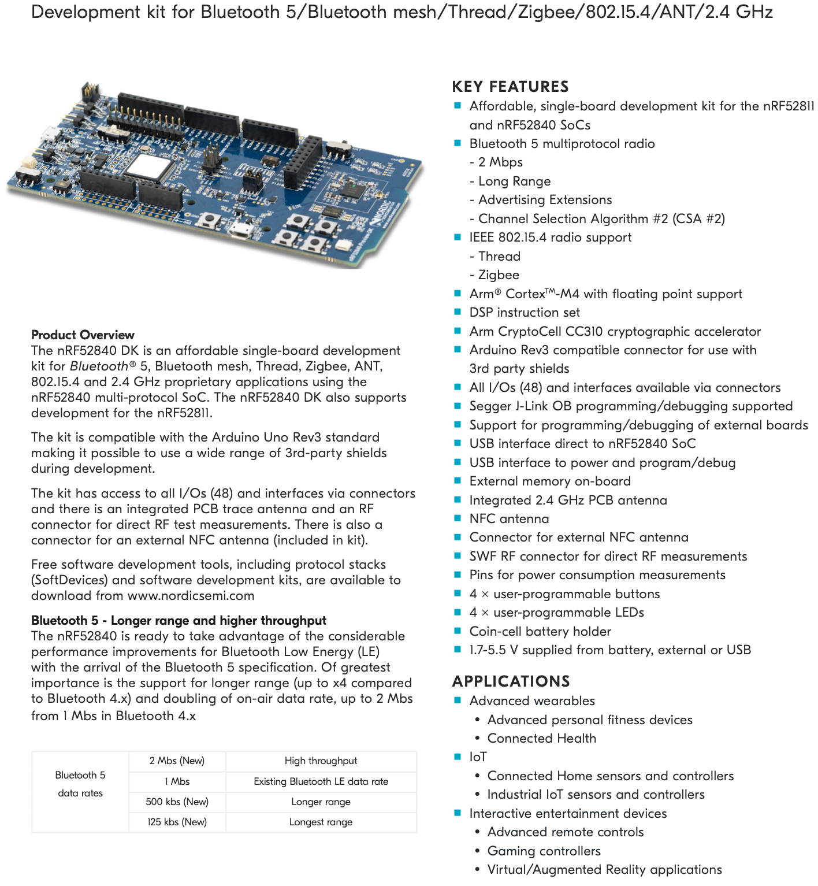

# Ablativo Architecture
The following paragraph describes the architecture of the product, in terms of the software modules that build it. 

Ablativo aims to be an innovative mobile application in the smart museum IoT world.

1. The main flow of the application starts with the interaction between the smartphone and the beacon sensor. 

2. When you enter the area covered by the beacon, the mobile device recognizes the id of the sensor and sends it to the back-end. This communication is managed by Bluetooth Low Energy Technology.

3. Then the back-end searches in the database the pair `<id, statue>` and starts sending messages to the user's chat. The chat acts like a bot. Send predefined questions and answers, the whole Q&A flow can be represented as a finite-state automaton where from a starter state we can always arrive at the final state.

4. The dashboard for data analysis communicates with the back-end and requires data in the database. Then displays the real-time results in an HTML web-page.

Now we have a general overview and we can go into the details of the components that make up the main architecture.

**NOTE**: there may be changes in the architecture, we will update this image each time a component is added / removed

---
### Table of contents
[Mobile application](#app)
[BackEnd](#be)
[DataBase](#db)
[Dashboard for data analysis](#dboard)
[Beacon](#beacon)

---
## Mobile application
It is an open-source application available on our git repository and provided as apk. We are talking about a hybrid app developed on ***React Native***, a cross-platform mobile development framework that allows programmers to create apps for both iOS and Android in one simple language, JavaScript. Indeed React Native runs on React, an open-source library for building UI with JavaScript, this framework through a set of components builds a mobile application with a native look and feel. Due to the pretty simple learning curve and well-balanced performance React Native it’s the perfect compromise for our application.

---
## BackEnd
Core of the application, hosts all the services of the product exposed both to the mobile application and dashboard. 
In this case, the Backend is fully developed on ***Node.js***, an open-source asynchronous event-driven JavaScript runtime designed to build scalable network applications.
Its intrinsic feature of non-blocking I/O, the fantastic community, and overall performance made Node.js the perfect choice for our application. Indeed a Node.js app is run in a single process without creating a new thread for each request and the provided set of asynchronous I/O primitives prevent JavaScript code from blocking.

---
## DataBase
Data storing module, contains all the data of the application. Implemented with MongoDB, one of the most popular document-oriented Database (NoSql) well suited to live with Node.js environment. As said in **MongoDB** official site:
> *Built around JSON-like documents, document databases are both natural and flexible for developers to work with. They promise higher developer productivity and faster evolution with application needs. As a class of non-relational, sometimes called NoSQL database, the document data model has become the most popular alternative to tabular, relational databases.*

---
## Dashboard for data analysis
Management and monitoring module, practically speaking the admin console. In this case, a web application running on every browser developed in Handlebars, a simple templating language that uses a template and an input object to generate HTML or other text formats. Furthermore, we will use WebSockets transport protocol to show the data in real-time. Finally the basic technology for a common web application: BootstrapCSS, JavaScript, JQuery.

---
## Beacon
Beacon uses the proximity perception of Bluetooth LE to transmit a unique universal identifier (UUID), which will then be read by a specific app or operating system. Once the signal is read, the app can perform various scheduled actions.
To realize this procedure in our system we have thought at two options:
* **Beacon STM32**
* **nRF52840 DK**

The following are a table with the main parameters we are interested in, more technical details are described in the next sections:

| | Beacon STM32 | nRF52840 DK |
|---|---|---|
| BLE | ✅ | ✅ |
|Bluetooth version | 4.1 | 5 | 
| Wifi | ⚠️ (extension board needed) | ✅ | 
| CPU | ARM Cortex-M| ARM Cortex-M4 |
| Cost | 35-38€ | 40-43€ |

### 1. Beacon STM32
The beacon is made of two components: 
* `NUCLEO-F401RE` STM32 Nucleo board
* `X-NUCLEO-IDB05A1` expansion board

The X-NUCLEO-IDB05A1 is an expansion board for use with STM32 Nucleo boards. To function correctly, the X-NUCLEO-IDB05A1 must be connected to the STM32 Nucleo board as shown in the following figure.

#### 1.1 NUCLEO-F401RE
The STM32 Nucleo board is a low-cost and easy-to-use development platform used to quickly evaluate and start a development with an STM32 in 32-pin package, 64-pin package and 144-pin package.
[NUCLEO-F401RE official references on STM32](https://www.st.com/en/evaluation-tools/nucleo-f401re.html)

#### 1.2 X-NUCLEO-IDB05A1
Bluetooth Low Energy expansion board based on the SPBTLE-RF BlueNRG-MS module for STM32 Nucleo board.
[X-NUCLEO-IDB05A1 official references on STM32](https://www.st.com/en/ecosystems/x-nucleo-idb05a1.html)

### 2. nRF52840 DK
