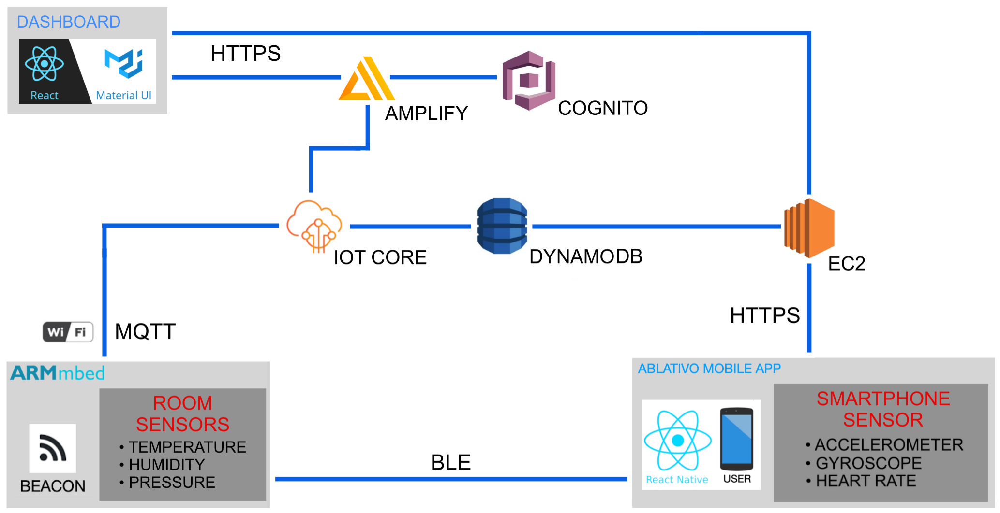
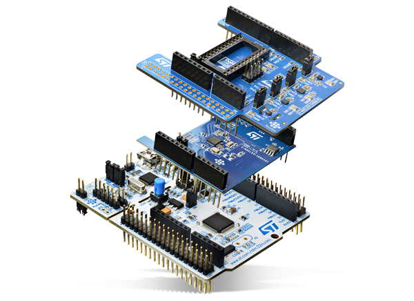

# Ablativo Architecture
This document provides details on the technical aspects of the product, including a high-level presentation of the conceptual architecture and information about the software and hardware components.

The following paragraph briefly describes the execution flow of the service and gives a high-level overview of the overall components. 

1. The main flow of the mobile application starts with the interaction between the smartphone and the beacon sensors (one for each room) through the BLE protocol. 

2. When the visitor enters an area covered by a beacon, the mobile device recognizes the id of the sensor and sends it to the back-end deployed on EC2. 

3. The back-end searches in the DynamoDB database for the data of the corresponding room and a bot starts sending messages to the user's chat, addressing predefined questions and answers. The whole Q&A flow can be represented as a finite-state automaton where from a starter state, we can always arrive at the final state.

4. During the visit, both smartphone and embedded devices retrieve the values from some sensors to reconstruct the activity/emotions of the user. The sensors are managed by IoT core.

5. All the data retrieved by the sensors are collected in the database. At the end of the visit, these are converted into musical notes, then used as input for a Neural Network deployed on Sagemaker to generates a melody.

6. At the same time, the dashboard for data analysis shows to the curator the environment telemetries and statics about the number of visitors inside the museum. 

Now we have a general overview, and we can go into the details of the components that make up the leading architecture.

---
### Table of contents
* [Mobile application for visitors](#app)
* [Dashboard for data analysis](#dboard)
* [Amazon web service](#aws)
    * [IoT Core](#iot)
    * [DynamoDB](#dyno)
    * [EC2 (application back end)](#ec2)
    * [Cognito](#cognito)
    * [Amplify](#amply)
    * [Lambda](#lambda)
    * [Sagemaker](#sage)
    * [SNS](#sns)
* [Sensors](#sensors)
    * [Beacon + Environmental telemetries](#beacon)
    * [Smartphone Sensors](#smartsens)
    * [Simulated Heart rate](#simsens)
* [User Activity/Emotion recognition](#uaer)
* [Music generation](#rnn)
* [Previous versions](#prev)

---
## Mobile application for visitors

It is an open-source application available on our git repository and provided as apk. We are talking about a hybrid app developed on ***React Native***, a cross-platform mobile development framework that allows programmers to create apps for both iOS and Android in one simple language, JavaScript. Indeed React Native runs on React, an open-source library for building UI with JavaScript, this framework through a set of components builds a mobile application with a native look and feel. Due to the pretty simple learning curve and well-balanced performance React Native it’s the perfect compromise for our application.

---
## Dashboard for data analysis
Management and monitoring module, practically speaking the admin console. It is implemented as a **React + Material UI** web application so that to have a fully responsive and accessible from everywhere tool, with great performances and a pleasant Material Design interface. It provides information about:
* The current environmental status of the museum, showing the telemetries collected by the embedded sensors;
* The number of visitor inside the museum using the mobile application
* The number of likes that each artwork receive;

In future releases, it may include other functionalities, such as a calendar, Q&A fast personalization, and so on.

---
## Amazon web service
Amazon Web Services (AWS) is the world’s most comprehensive and broadly adopted cloud platform, providing a variety of basic abstract technical infrastructure and distributed computing building blocks and tools.
Let's see the single compontents used by Ablativo

### IoT Core
AWS IoT Core is a managed cloud service that lets connected devices easily and securely interact with cloud applications and other devices. It can support billions of devices and trillions of messages, and can process and route those messages to AWS endpoints and to other devices reliably and securely.
It provides automated configuration and authentication upon a device’s first connection to AWS IoT Core, as well as end-to-end encryption throughout all points of connection, so that data is never exchanged between devices and AWS IoT Core without proven identity.
Finally, the latest state of a connected device so that it can be read or set at anytime, making super easy to configure a failure detector.

### DynamoDB 
Amazon DynamoDB is a key-value and document database that delivers single-digit millisecond performance at any scale. It's a fully managed, multiregion, multimaster, durable database with built-in security, backup and restore, and in-memory caching for internet-scale applications.
DynamoDB supports ACID transactions to enable you to build business-critical applications at scale. DynamoDB encrypts all data by default and provides fine-grained identity and access control on all the tables.

However, given the price, for possible deployment, we may use **Amazon Timestream** for the telemetries (currently not available for educate accounts).

### EC2 (application back end)
Amazon Elastic Compute Cloud (Amazon EC2) is a web service that provides secure, resizable compute capacity in the cloud. It is designed to make web-scale cloud computing easier for developers.
Here there is the application Back-end, fully developed on ***Node.js***, an open-source asynchronous event-driven JavaScript runtime designed to build scalable network applications.
Its intrinsic feature of non-blocking I/O, the fantastic community, and overall performance made Node.js the perfect choice for our application. Indeed a Node.js app is run in a single process without creating a new thread for each request and the provided set of asynchronous I/O primitives prevent JavaScript code from blocking.

### Cognito
Amazon Cognito lets add user sign-up, sign-in, and access control to web and mobile apps quickly and easily.
In our case, it is used only for the curators' authentication in the Dashboard. Moreover, given the fact that only the museum curators can access the web application, the registration form is blocked, and only the admin can add new users from the AWS console.

### Amplify
AWS Amplify is an end-to-end solution that enables mobile and front-end web developers to build and deploy secure, scalable full-stack applications.
This framework provides different components that simplify the configuration of various application components.
In our case:
- Authentication for user registration & authentication
- API (GraphQL and REST) to access the database
- PubSub to manage messaging & subscriptions (sensors)

### Lambda
Lambda is an event-driven, serverless computing platform that runs code in response to events and automatically manages the computing resources required by that code.
In our case it used to collect the telemetries of an user in order to feed the machine learning model.

### Sagemaker
SageMaker is a fully managed service that provides every developer and data scientist with the ability to build, train, and deploy machine learning (ML) models quickly.
Here we have the music generation.

### SNS
Amazon Simple Notification Service (SNS) is a fully managed messaging service for both system-to-system and app-to-person (A2P) communication. It enables you to communicate between systems through publish/subscribe (pub/sub) patterns that enable messaging between decoupled microservice applications or to communicate directly to users via SMS, mobile push and email.
We are using it to send the music to the user mail.

---
## Sensors

### Beacon + Environmental telemetries

Both functionalities are imlemented on a single a board, running **Mbed-OS**.

* Beacon uses the proximity perception of *Bluetooth Low Energy* technology to transmit a unique universal identifier (UUID), which will then be read by a specific app or operating system. Once the signal is read, the app can perform various scheduled actions. 

* The environmental telemetries collected by the board are sent to the cloud using the MQTT protocol, through the wifi module. The benefits of this procedure are twofold. Indeed, aside from the obvious environmental check, these messages also act as alive Heartbeats for a simple failure detector. The data collected are
    - `Temperature`
    - `Humidity` 
    - `Pressure` 

   
    

The board used for the *Proof of work* is the **B-L475E-IOT01A**, which is an STMicroelectronics Discovery Kit for IoT Node that easily allows development of applications with direct connection to cloud servers. The Discovery kit enables a wide diversity of applications by exploiting low-power communication, multiway sensing and ARM® Cortex® -M4 core-based STM32L4 Series features. The support for Arduino Uno V3 and PMOD connectivity provides unlimited expansion capabilities with a large choice of specialized add-on boards. More information about this board can be found [here](https://www.st.com/en/evaluation-tools/b-l475e-iot01a.html).

Another possible alternative may be the `NUCLEO-F401RE` STM32 Nucleo board, with the application of these three components: 
* `X-NUCLEO-IDB05A1` BLE expansion board
* `X-NUCLEO-IDW01M1` Wifi expansion board
* `X-NUCLEO-IKS01A2` sensors expansion board

However, we opted for the first option, given the higher reliability. The drivers for this expansion boards are mostly deprecated, and the documentation advices to avoid them for new design. Moreover, it does not provide a true random numbers generator, damaging the TLS protocol.

### Smartphone Sensors
We will periodically retrieve values from 4 smartphone sensors:
* `Accelerometer` 
* `Gyroscope`
* `Ambient Light Sensor`

To retrieve them we use React Native framework sensors API. These values are necessary to detect the user actions, and therefore to generate the final melody.

### Simulated Heart Rate
`Heart Rate` sensors is for now simulated with a script that randomly, and periodically, sends the values to the cloud.

#### NOTE
Why not MQTT-SN for the board? It works over UDP, which is an "unreliable" protocol. If a message gets lost, the failure detector can wrongly detect a crash. Thus, since we send messages every 10/15 minutes only, there is no reason to increase the complexity of the system (requiring intermediate broker and transparent gateway), and relax our strong assumptions of prefect links and synchronous system.

---
## User Activity/Emotion recognition
In this part we deal with the technical aspects we have in mind to create a personalized melody for the user.

#### Data Collection
The first thing to do is to extract the values from the sensors. We decided to use:
* ***4 ambient sensors***: `Temperature`, `Humidity` and `Pressure` with STM board, and `Ambient Light Sensor` with the smartphones of the users. These aren't personal values but they affect the emotional condition of the users.
* ***3 personal sensors***: `Accelerometer`, `Gyroscope`, `Heart Rate Sensor`. These values are different for every user because they depend on the activity they are doing.
* ***Interaction with application***: `Most frequently asked questions`, `Time spent with the statue with which he interacted most`, `Total application usage time`. These are three main measure that helps us to understand how the user interacts with the statues. 

We based our analisys on these papers: 
* [Emotion Detection Using Noninvasive Low Cost Sensors](https://arxiv.org/pdf/1708.06664.pdf)
* [*MoodExplorer: Towards Compound Emotion Detection via Smartphone Sensing*](https://dl.acm.org/doi/pdf/10.1145/3161414?download=true)
* [*Emotion recognition using mobile phones*](https://www.researchgate.net/publication/317123457_Emotion_recognition_using_mobile_phones)

#### Convert data into musical notes
To convert data in music notes we will try to use python Music Algorithms:

* [*Convert Scientific Data into Synthesized Music*](https://makezine.com/projects/synthesized-music-data/)

* [*Numbered musical notation*](https://en.wikipedia.org/wiki/Numbered_musical_notation)

---
## Music generation
In the world of machine learning there are many ways to generate music. These options are the most likely for our purposes:

* [*Magenta*](https://hello-magenta.glitch.me)
* [*Neural Nets for Generating Music*](https://medium.com/artists-and-machine-intelligence/neural-nets-for-generating-music-f46dffac21c0)
* [*How to Generate Music using an LSTM Neural Network in Keras*](https://towardsdatascience.com/how-to-generate-music-using-a-lstm-neural-network-in-keras-68786834d4c5)
* [*Music Generation Using Deep Learning*](https://medium.com/datadriveninvestor/music-generation-using-deep-learning-85010fb982e2)

---
## Previous versions

* [Architecture - delivery 1](https://github.com/Ablativo/ablativo/blob/1st-delivery/Architecture.md)
