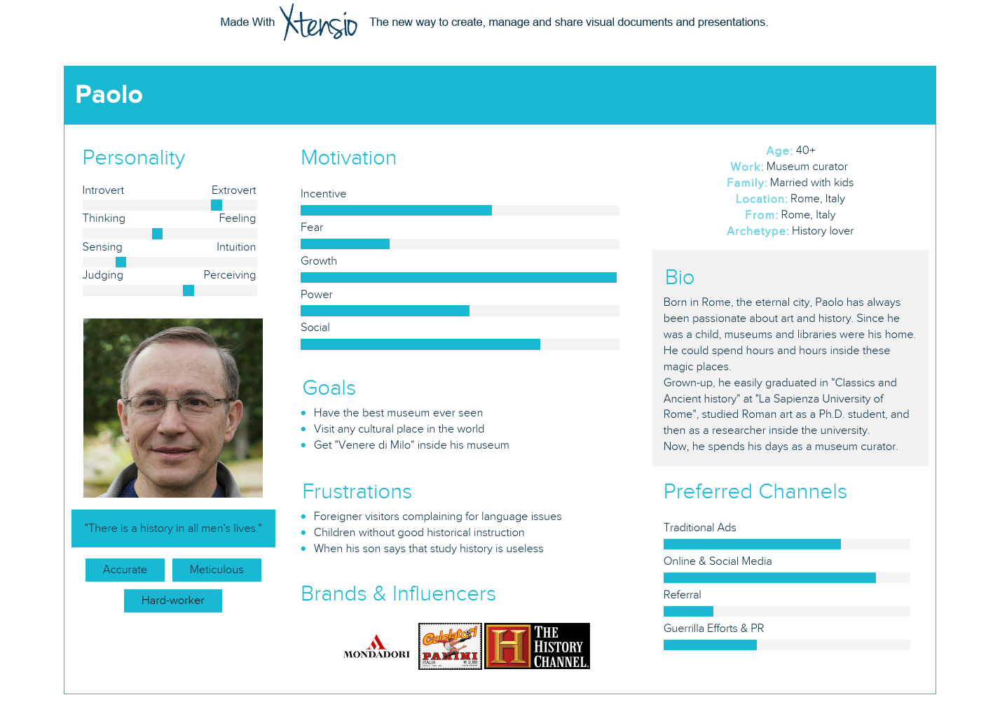
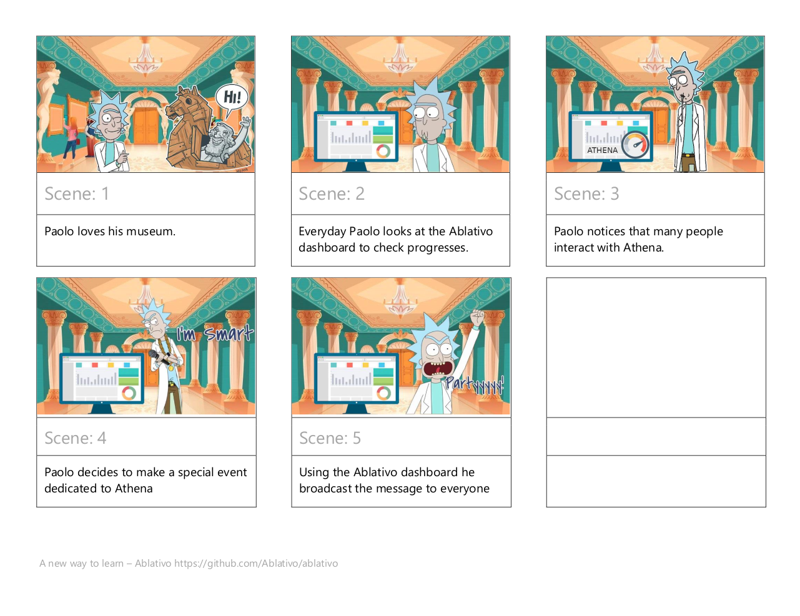

# Design
In this document, we will approach the product from the user's point of view, leaving aside all the technical information. Indeed, here we want to emphasize the *"product design"* methodologies we have used to build the idea, and how these directly influenced the final product.

Since the application is thought to be used by everyone who could enjoy a visit inside a museum, we started our journey with a simple survey, sharing it with our family, friends, and friends of friends.
It gave us an idea of the opinions people would have (explained in the "Evaluation" document), and helped us to better understand who and how the user would use our product.

---
### Table of contents
* [Idea](#idea)
* [User personas](#up)
* [Storyboards](#story)
* [Mockup app](#mock)

---
## Idea

#### PROBLEM
For most people museums are boring, out-of-date, still too far from the contemporary idea of interactivity. 
Therefore, we want to renew this preconception, to bring closer also non-art lovers, providing them with a different way to learn new things.

#### SOLUTION
Make artworks come to life!
1. The user connects to the Ablativo mobile application;
2. When he/she approaches an artwork, it starts a new conversation with the user, via chat;
3. The user can now choose which question ask to the statue (for now precompiled ones);
4. The artwork, simulated by a bot, can answer questions or even make proposals to the user.
5. While the user visits the museum, the mobile application will collect data about his/her personal experience. At the end of the visit, a machine learning algorithm will mix them with those provided by the environmental sensors, and elaborate everything to produce a pleasant song. A final romantic gift to remember the emotions experienced during the visit. 

#### BENEFITS
- USERS: Interacting with the application, the users receive targeted information on the pieces of art they are interested in. 
Therefore, they are not forced to read the entire description, but only ask for the things that interest them. 

- MUSEUM: The application can collect information on the most frequently asked questions posed to statues, including which are most in-demand. 
	Then, these data could also help in advertising marketing strategies by analyzing visitors' interests more closely.

EXTRA: Once collected enough data, analyzing the interactions, the app could be extended to a real path inside the museum, guided by the statues. A real "treasure hunt" with the suggestions of the artworks.

---
## User personas
All the user personas are inspired by real people that gave their contribution to the survey and showed particular interest in the project.

#### Visitors
For the visitors, we have as main actors, Lorenzo and Martina, representing all those guys, like us, boys and girls, with different personalities, that appreciate the opportunities provided by the application we are building.

Maryen and Federico, instead, represent our second target, international students, and older users. Indeed, our survey had a lot of success also with these other 2 categories of people. Therefore, we want to avoid focusing too much on the first category, penalizing the other possible users.

#### Museum curator

---
## Storyboards

#### Visitor

#### Museum curator

---
## Mockup app

---
## Previous versions
* [Design - delivery 1](https://github.com/Ablativo/ablativo/blob/1st-delivery/Design.md)
