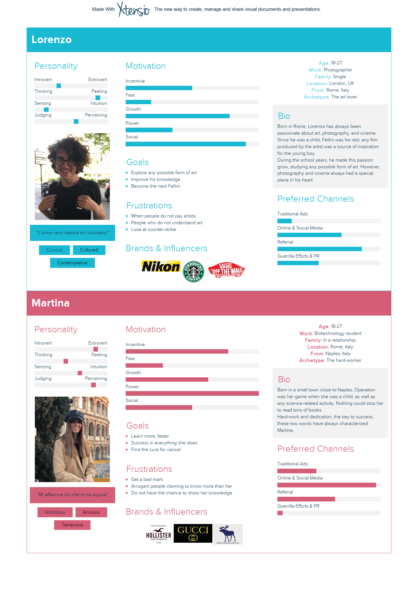
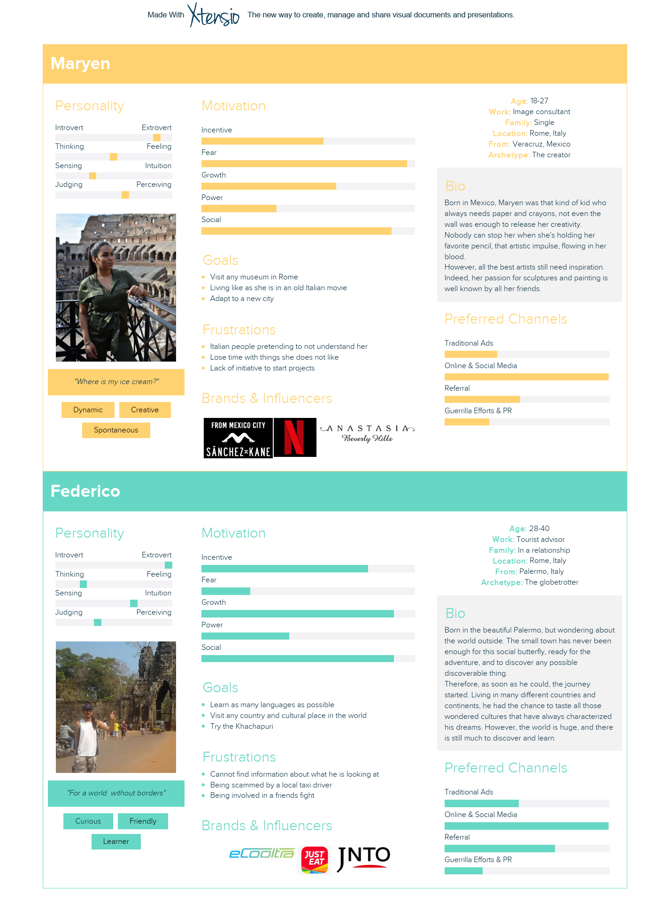
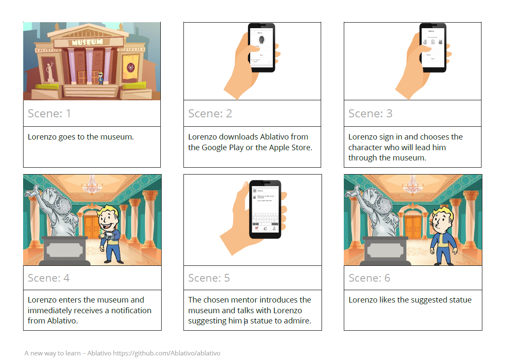
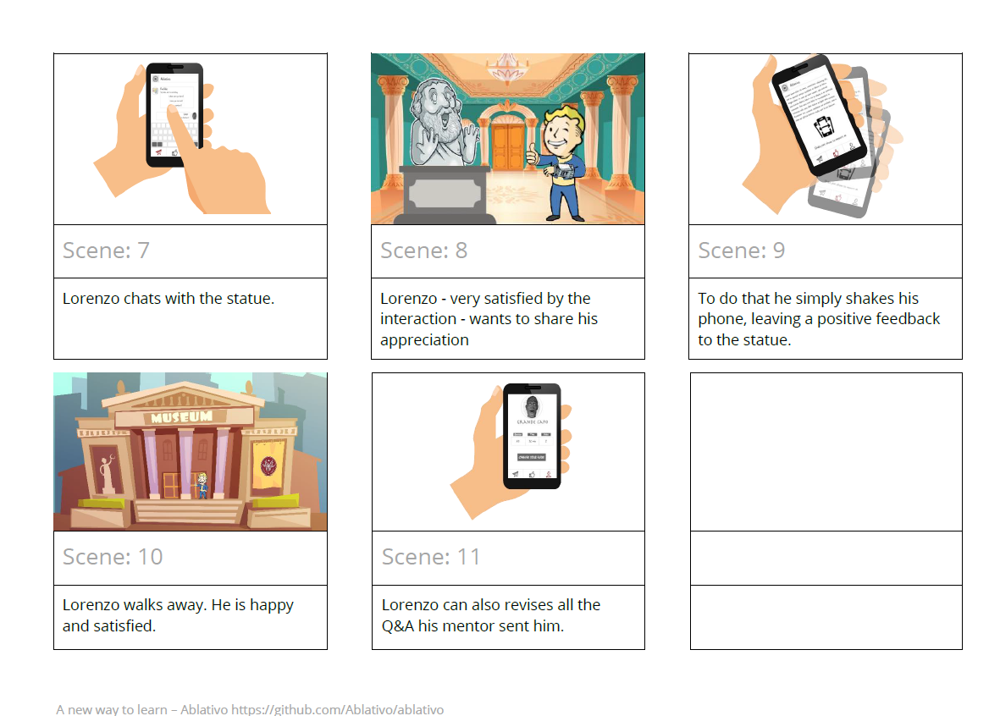
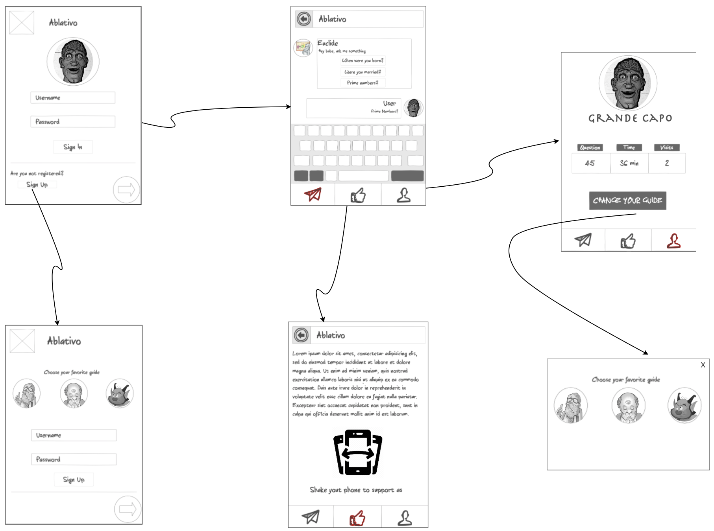

# Design
In this document, we will approach the product from the user's point of view, leaving aside all the technical information. Indeed, here we want to emphasize the "product design" methodologies we have used to build the idea, and how these directly influenced the final product.

Since the application is thought to be used by everyone who could enjoy a visit inside a museum, we started our journey with a simple survey, sharing it with our family, friends, and friends of friends.
It gave us an idea of the opinions people would have (explained in the "Evaluation" document), and helped us to better understand who and how the user would use our product.

## User personas
All the user personas are inspired by real people that gave their contribution to the survey and showed particular interest in the project.

The main actors, Lorenzo and Martina, represent all those guys, like us, boys and girls, with different personalities, that appreciate the opportunities provided by the application we are building.

Maryen and Federico, instead, represent our second target, international students, and older users. Indeed, our survey had a lot of success also with these other 2 categories of people. Therefore, we want to avoid focusing too much on the first category, penalizing the other possible users.

## Storyboards

## Mockup

