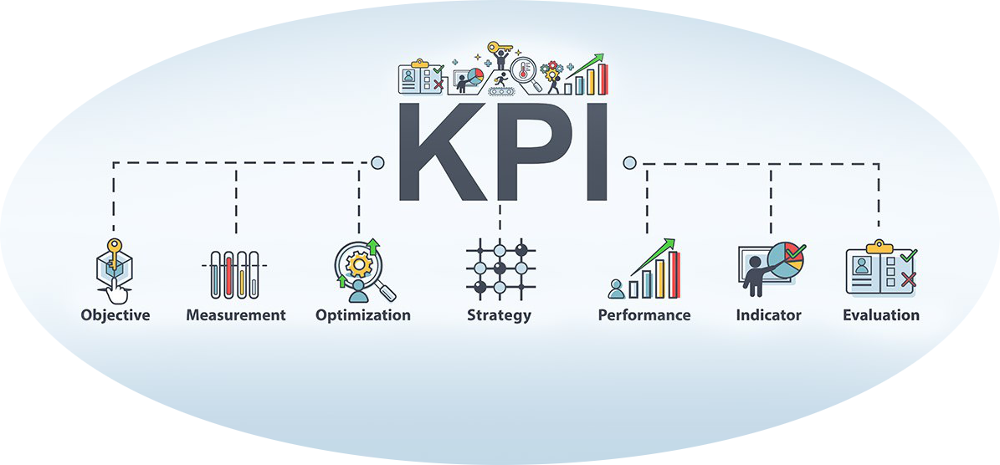
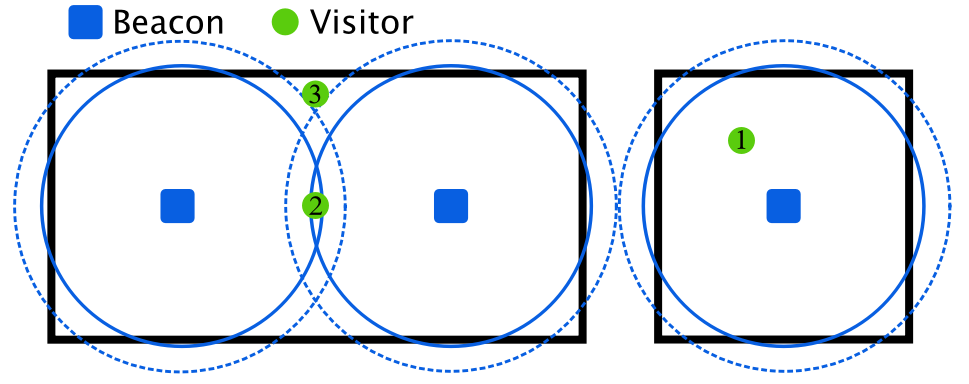

# Evaluation
This document aims to provide details on how to evaluate the product, first from a user experience point of view, and then from a technical point of view.

We based our evaluation model in the well known **Key Performance Indicators**. The generic identikit of the KPIs must meet certain characteristics: the indicators must be ***quantifiable*** (and therefore measurable); ***management***, i.e. they must indicate whether the company is growing or not; ***operational***, and therefore exercise an effective change in the strategy adopted; finally ***practical***, and therefore adaptable to business needs.

---
### Table of contents
* [User experience](#usex)

* [Technical aspects](#tech)

* [Implementantion state](#state)

* [Implementation costs](#costs)

* [Competitors](#comp)

---
## User experience

#### Users survey
To first evaluate the idea, we have used a survey, sharing it with our family, friends, and friends of friends. Indeed, by these feedbacks and suggestions, we (hopefully) understood where to make some changes, and especially if the final user would really like and possibly use the final service.

Here the anonymous results:
- [International](https://docs.google.com/spreadsheets/d/15IgMSvd-63VwI2cXw7SHC1U36O2IEgHQvG_yR56Y7Nk/edit#gid=675511585)
- [Italian](https://docs.google.com/spreadsheets/d/1EfuZT_q8hNwSY7gu_bXCDNayzk7qYUeNwSBV3rvE9xY/edit#gid=510814664)

Here the most relevant graphs:
- [International](./pdf/graph_international.pdf)
- [Italian](./pdf/graph_Italy.pdf)

We received more than 100 replies from Italian people, and more than 40 from people spread over 15 different countries.
| | Result |
|----|----|
1 | Over 90% of them believe this service would be useful to improve the learning of the fundamental characteristics of a work of art, help the museum to provide a better service, boost their curiosity, and would have fun trying the application.
2 | The same percentage of people would go to the museum to try the novelty, however, in Italy, only around 50% if they have already been there, while in the other countries this percentage increases to ~65%.
3 | Finally, over 80% of these people told us they are thinking to download for real our application on their smartphone.

#### Evaluation metrics
Now, let's define the parameters for the final evaluation:
* **Accessibility**: any type of user who knows how to use a chat must be able to use Ablativo.
* **Simplicity**: Ablativo must be intuitive:
    * The museum visitor can easily sign-in/sign-up and choose his/her mentor;
    * The museum visitor can easily interact with the mentor/statue, which must provide an extensive set of questions;
    * The museum curator can easily understand and see the statistics of the metrics collected by the service;
* **Usability**: The response times of the chat must be rapid, otherwise this may lead the user to not use the application.
* **Graphic interface**: The overall interface must be user friendly and pleasant.
* **Privacy & Security**: Ablativo does not store any sensible data. The passwords are hashed as for standard requirements.

---
## Technical aspects

Let's analyse the Technical aspects through the edge components that interface directly with the user. Here the status glossary:
* ✅ Completed
* ⚠️ Work in progress
* 🔜 For the future

### Sensors measurements overview
The list of all the sensors we are using in our application.
* **Ambient sensors**: Let's assume we have N rooms inside the museum, we will put one STM board per room. Each board has `Temperature`, `Humidity`, and `Pressure` sensors. Moreover, it works as a `Beacon`.

* **Smartphone sensors**: We retrieve the values from the smartphone sensors of every user. These values are real. We are able to collect the values with a frequency of 1Hz (1 message per second), so the values are grouped and sent periodically.

* **Heart Rate sensor**: For the PoC, the values are simulated with a JS script that (with a frequency of 1Hz) generates random values and sends them to the cloud and to the backend of the application.

### Beacon-Sensors board

##### Metrics description
* **Accessibility**: indicates the ability of the technology to be exploited by the user.
* **Accuracy**: average error in calculating the distance from the statues.
* **Precision**: how the system works overtime, how similar the various measurements are to each other, which does not necessarily mean that the system is accurate.
* **Robustness**: the system's ability to resist interference and noise from nearby sensors
* **Scalability**: the scalability of a system ensures its normal operation even when the sphere of the application becomes larger.
* **Cost**: the cost of a system like this can depend on several factors. The most important ones include money, time, space, weight, and energy. The time factor is linked to installation and maintenance times.
* **Security**: security means the danger that data sent through the system will be violated or accessed by third parties.
* **Failure detection**: the system must be able to notify the museum if there is a fault.

##### Metrics evaluation
| Metrics | Status |Solution/Result |
| ------------- |:---:| :-----|
| `Accessibility` | ✅ | Battery-powered, the board can usually last up to 2 years. The devices can be placed on any surface accessible from the mobile app. |
| `Accuracy` | 🔜 | Calculated as the average of the Euclidean distance between the estimated and the real position |
| `Precision` | 🔜 | Comparison of the various measurements |
| `Robustness` | ✅ | Strategic points where to place the sensor. We have (in general) 1 beacon per room instead of 1 beacon per statue. May be more for larger rooms.
| `Scalability` | ✅ | Beacons transmit only constant output signals, which do not change with the number of devices.
| `Cost` | ✅ | The cost of the sensors depends on the model but in general is about few euros  |
| `Security` | ✅ | The beacon transmits only output signals, thus there is no intrinsic safety risk in the transmission. All the interactions with the cloud are encrypted and signed to ensure authenticity. |
| `Failure detection` | ✅ | The AWS IoT Core service gives the ability to check the status of the connect devices and therefore disconnections. |

##### Accuracy and Precision in details
A correct statistical analysis would require the final production board and the opportunity to make tests inside a real museum, which is now impossible due to the COVID situation. However, we can start by making some assumptions and defining some directives. 

Let's take, for eaxmple, the iBeacon definition, which categorize the "beacon - mobile device" into 3 distinct ranges:
- Immediate: Within a few centimeters
- Near: Within a couple of meters 
- Far: Greater than 10 meters away

If we assume that each room is a few meters large and the "near" category, we have the following situation

Each room has at least one beacon in the centre or more in case of larger rooms. For the correct behaviour of the service, we must ensure that each room is covered for most of its surface, avoiding at the same time interferences with the other rooms. Thus, the visitor may be in 3 possible situations:
1. The visitor is inside the optimal range, and there are no interferences from other devices: no problems for the correct behaviour of the service;
2. The visitor is inside the range of two different beacons: he/she may receive messages from the artworks of both. This is not a problem if they are both inside the same room, but may be annoying in case of different rooms.
3. The visitor is outside the range of any beacon: he/she will not receive any message even if still inside the museum.

In case the beacon range goes over the required scope, we may adjust it by covering the beacon with some shielding material. However, there will always be some interferences or uncovered surfaces. Thus, our goal is to find a good trade-off.

### Mobile app
##### Metrics description
* **Accessibility**: indicates the ability of the technology to be exploited by the user.
* **Complexity**: complexity can be attributed to hardware, software needed for the system.
* **Scalability**: the scalability of a system ensures its normal operation even when the sphere of the application becomes larger.
* **Cost**: the cost of a system like this can depend on several factors. The most important ones include money, time, space, weight, and energy.
* **Security**: security means the danger that data sent through the system will be violated or accessed by third parties.

##### Metrics evaluation
| Metrics | Status |Solution/Result |
| ------------- |:---:| :----- |
| `Accessibility` | ✅ | Accessible with a any smartphone, both IOS and Android|
| `Complexity` | ✅ | Thanks to the React native framework the implementation is very simple and fast |
| `Scalability` | ✅ | The AWS cloud infrastructure ensures there is always enough computing power |
| `Cost` | ✅ | Some fees may be applied by the App stores |
| `Security` | ✅ | All data provided by the users are encrypted. No sensible data needed |

### Web dashboard
##### Metrics description
* **Accessibility**: indicates the ability of the technology to be exploited by the user.
* **Complexity**: complexity can be attributed to hardware, software needed for the system.
* **Scalability**: the scalability of a system ensures its normal operation even when the sphere of the application becomes larger.
* **Cost**: the cost of a system like this can depend on several factors. The most important ones include money, time, space, weight, and energy.
* **Security**: security means the danger that data sent through the system will be violated or accessed by third parties.

##### Metrics evaluation
| Metrics | Status |Solution/Result |
| ------------- |:---:| :----- |
| `Accessibility` | ✅ | Accessible with a any smartphone, tablet or computer|
| `Complexity` | ✅ | Thanks to the React framework the implementation is very simple and fast |
| `Scalability` | ✅ | The AWS cloud infrastructure ensures there is always enough computing power |
| `Cost` | ✅ | More details on the [AWS Cost](#AWScosts) section |
| `Security` | ✅ | No sensible data needed. The authentication is provided by Cognito and only previously accepted user can Sign-in |

---
##  Implementation state
Ablativo is made by different components that need to fully interact with each other. These interactions must be well defined.

Glossary:
* ✅ Completed
* ⚠️ Work in progress
* 🔜 For the future

#### STM board - Environmental sensors / BLE 
| Feature | Status |
| :---- | :----: |
| The board must be able to retrieve values from the Temperature sensor | ✅ |
| The mobile app must be able to retrieve values from the Humidity sensor | ✅ |
| The mobile app must be able to retrieve values from the Pressure sensor | ✅ |
| The beacon must be able to broadcast BLE packets | ✅  |
| The BLE packets must have the correct format to be used by the application | ✅  |

#### STM board - AWS
| Feature | Status |
| :---- | :----: |
| The STM board must be able to establish a wifi connection | ✅ |
| The STM board must be able to enstablish a connection with the IoT core MQTT broker | ✅ |
| The STM board must be able to send values through an MQTT connection | ✅ |

#### Mobile application - Beacon
| Feature | Status |
| :---- | :----: |
| The mobile device must be able to broadcast and accept BLE packets | ✅ (PoC) |
| The mobile device must be able to read the Id of the beacon it interacts with | ✅ (PoC) |
| If the user moves away, the mobile device must be able to understand that it is no longer near the work of art | ⚠️ |

#### Mobile application - Smartphone sensor
| Feature | Status |
| :---- | :----: |
| The mobile app must be able to retrieve values from the Accelerometer | ✅ |
| The mobile app must be able to retrieve values from the Gyroscope | ✅ | 

#### Mobile Application - BackEnd
| Feature | Status |
| :---- | :----: |
| The mobile application must be able to send the request to and receive a response from the back-end via HTTP through fetch construct | ✅ |
| The mobile application must be able to interact with the backend to establish a dialog between the user and the mentor/statue, receiving and sending messages | ✅ |
| The interaction between the mobile application and the backend must be safe and guarantee the privacy of the user | ✅ |
| The interaction between the mobile application and the backend must guarantee predictable behavior in case of failures or critical situations | ✅ |
| The interaction between the mobile application and the backend must guarantee correct behavior in case of unexpected input or situation | ✅ |
| The mobile application must be able to guarantee the login on the application | ✅ |
| The interaction between the mobile application and the backend must be flexible so that fixes, upgrade and new development can be easily implemented | ✅ |
| The user should be able to choose and change the mentor, so the application must be able to communicate that operation to the backend | ✅ |
| The mobile application must be able to interact with the user with a chatbot | ✅ |
| The chatbot must be a finite-state automaton | ✅ |

#### Database - Dashboard / Mobile app BackEnd
| Feature | Status |
| :---- | :----: |
| Both dashboard and mobile app must be able to interact with the database through a query system, in particular, all the information needed may be retrieved. | ✅ |
| The database should be reachable in every moment, in case of a fault the system must be able to control the situation. | ✅ |
| Eventually sensible data must be encrypted by the backend before the insertion. | ✅ |
| The interaction between the database and the backend must be able to guarantee backup services and disaster recovery procedures. | ✅ |
| The interaction between the database and the backend must guarantee the consistency of the information stored. | ✅ |

#### Dashboard functionalities
| Feature | Status |
| :---- | :----: |
| Number of visitors inside the museum using the mobile applicatio | ✅ | 
| The current environmental status of the museum, a.k.a the telemetries collected by the embedded sensors | ✅ |
| Details about the current status of each room and artwork | ✅ |

#### AWS Virtual Private Cloud (VPC) internals
| Feature | Status |
| :---- | :----: |
| IoT core must be able to forward the telemtries to the DynamoDB database, which stores them | ✅ |
| The app back-end on EC2 must be able to interact with the DynamoDB database in order to insert, update and delete tuples | ✅ |
| AWS amplify must be able to retrieve useful data from the DynamoDB database | ✅ |
| AWS amplify must be able to interact with Cognito so as to ensure the curators authentication | ✅ |
| AWS amplify must be able to interact with IoT core in order to detect devices failures | 🔜 (PoC) |

#### User activity recognition - Music Generation
| Feature | Status |
| :---- | :----: |
| The database must be able to collect data from the sensor associated with the user | ✅ |
| The system must be able to convert the scientific data to musical notes | ✅ |
| The BackEnd must be able to send the data to MusicRNN | ✅ |
| Based on the musical notes, the Neural Network must be able to generate a melody | ✅ |

***PoC***: means that the functionality is simulated

---
## Implementation costs

####  AWS costs

---
## Competitors
In this table, we try to compare Ablativo with some of the applications already present in the world. In particular as competitors we have chosen:
- [First Romanian School](https://play.google.com/store/apps/details?id=com.first.romanianschool)
- [AMI Filangieri Smart Museum](https://play.google.com/store/apps/details?id=it.naosconsulting.ami&hl=it)
- [FluxGuide](https://www.fluxguide.com/en/)

Features | Ablativo | FRSchool | AMI | FluxGuide | 
|----|:----:|:----:|:----:|:----:|
Interaction with statues | ✅ | ✅ | ✅ | ✅
Activity/Emotion recognition | ✅ | ❌ | ❌ | ❌ 
Music Generation | ✅ | ❌ | ❌ | ❌ 
Chatbot to know specific features | ✅ | ❌ | ❌ | ❌ 
Mentor | ✅ | ❌ | ❌ | ❌
Different visit according to user's competence | 🔜 | ❌ | ❌ | ❌
Multiple language visits | 🔜 | ✅ | ✅ | ✅
Data Analysis for museums | ✅ | ❌ | ✅ | ❌
Complete description of statues | ❌| ✅ | ✅ | ✅
Voice messages | 🔜 | ❌ | ✅ | ❌
Audio guide | ❌ | ✅ | ✅ | ✅
Video guide | ❌ | ❌ | ❌ | ✅
Augmented Reality | ❌ | ❌ | ❌ | ❌
3D modeling | ❌ | ❌ | ❌ | ✅
Possibility of making treasure hunts | ✅ | ❌ | ✅ | ❌
Available to every museums | 🔜 | ❌ | ❌ | ✅

---
## Previous versions

* [Evaluation - delivery 1](https://github.com/Ablativo/ablativo/blob/1st-delivery/Evaluation.md)

* [Evaluation - delivery 2](https://github.com/Ablativo/ablativo/blob/2nd-delivery/Evaluation.md)